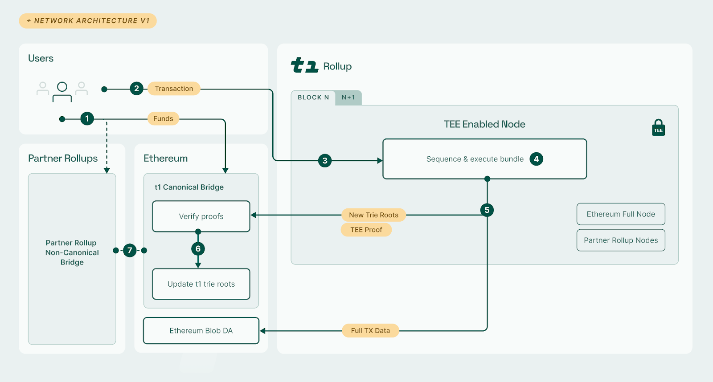
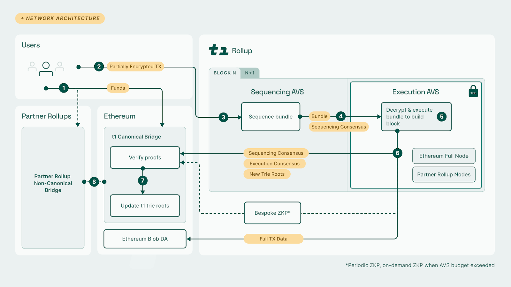

t1 is a TEE-enabled cross-chain application infrastructure that leverages defense-in-depth to achieve real-time proving. In the short-term (v1), we achieve RTP with TEE proofs. Longer term, t1 will become a permissionless and decentralized network that will complement TEE proofs with crypto-economic security and bespoke zero-knowledge proofs. You can read more about our long term architecture in our litepaper.

### Network Architecture v1

1. A user, Alice, deposits funds to a t1 bridge contract on Ethereum or on a _Partner Rollup_. Once the deposit is confirmed on the source chain, it gets processed by t1 and Alice gets her funds credited towards her aggregate t1 balance.

2. Alice creates a t1-native transaction either to interact with applications on t1 or to trigger transactions (including withdrawals) on Ethereum or a _Partner Rollup_.

3. A TEE enabled sequencer (node) receives the transactions, sequences and executes the block. As a part of execution, when required, the sequencer reads from (xChain Read) and writes (xChain Write) to Partner Rollups, both enabled within the TEE.

4. The TEE-enabled sequencer generates new trie roots _r_ and a TEE proof. These are submitted to the t1 Canonical Bridge contract on Ethereum and the full compressed transaction data is submitted to Ethereum blob DA.

5. t1’s _Canonical Bridge_ contract on Ethereum checks the newly submitted t1 trie root _r_ and TEE proof and transaction data availability for consistency. If successful, the trie root _r_ is accepted. This facilitates withdrawals to L1 with a single L1 slot delay (6s on average).

_Note: Suppose, Alice had desired to withdraw funds, in step 2. She may now submit to the Canonical Bridge an Ethereum claim transaction with an inclusion proof of her withdrawal transaction in t1 (as contained within the withdrawal trie committed to in r). The contract then releases the funds to Alice on Ethereum._

### Network Architecture v2

1. A user, Alice, deposits funds to a t1 bridge contract on Ethereum or on a _Partner Rollup_. Once the deposit is confirmed on the source chain, it gets processed by t1 and Alice gets her funds credited towards her aggregate t1 balance.

2. Alice changes her wallet’s network to t1, creates a t1-native transaction (with [some fields encrypted](https://www.notion.so/Litepaper-9a2cc4d321ce4a08a4905aa809fb436e?pvs=21) to the shared rotating TEE pubkey), uses her wallet to sign it, and submits it to the network (i.e. the t1 mempool); this may or may not be a specially-treated withdrawal transaction (to Ethereum or a _Partner Rollup_).
3. A t1 _Sequencer_ receives and gossips such a partially-blind transaction to other _Sequencers_ in the t1 _Sequencing AVS_ network.

4. After collecting transactions for one t1 slot (currently set to one second), the slot-leading _Sequencer_ proposes an ordering (a blind non-executed bundle). The rest of _Sequencers_ vote on it using Espresso HotShot, to form _Sequencing Consensus_. This bundle and a proof of _Sequencing Consensus_ is then passed on to the _Execution AVS_ network.

5. t1 _Executors_ validate the proof of _Sequencing Consensus_, decrypt the encrypted parts of the received bundle (if needed and due) using their TEE-derived shared rotating private key, and execute its now fully plaintext ordered transactions against the current state of the t1 blockchain. The slot-leading _Executor_ proposes a new trie root tuple _r_ of state trie root, withdrawals trie root, and proof-of-read trie root—and the rest of the _Executors_ vote on such new trie tuple _r_ to form _Execution Consensus_.

   - Note: _Executors_ use follower nodes also running in TEEs to read from and write to _Partner Rollups_ (whenever required by a t1 tx).

6. The _Execution_ AVS posts t1’s new trie roots _r_ and all the corresponding consensus proofs to the Ethereum t1 _Canonical Bridge_ contract and the full compressed transactions to Ethereum blob DA.

   - In addition, t1 progressively incentivizes the generation and posting of _periodic ZKPs_ to the _Canonical Bridge_ on Ethereum to create _ZKP checkpoints_ resetting the value-at-risk counters and also speeding up the potential _on-demand ZKP_ creation when required. t1 dynamic gas pricing considers how much AVS security budget is still available, to reach an equilibrium.
   - In the rare event that new t1 transactions’ (as per all new trie root tuples) cumulative value since the last _ZKP checkpoint,_ despite the mechanisms above, would exceed the crypto-economic security budget provided by _Execution AVS_, also an _on-demand ZKP_ is required by the _Canonical Bridge_, pausing finalization until then; this would increase the withdrawal delay to hours under such extreme conditions.

7. t1’s _Canonical Bridge_ contract on Ethereum checks the new submitted t1 trie root tuple _r_, _Sequencing Consensus,_ _Execution Consensus_ and transaction data availability for consistency. If successful, such _r_ is accepted. This then generally facilitates withdrawals from t1 to Ethereum with a single-Ethereum-block delay only (i.e. 6 seconds on average).

   - Suppose, Alice had desired to withdraw funds, in step 2. She may now submit to the _Canonical Bridge_ an Ethereum claim transaction with an inclusion proof of her withdrawal transaction in t1 (as contained within the withdrawal trie committed to in _r_). The contract then releases the funds to Alice on Ethereum.

8. If Alice wishes to withdraw funds to her account on a _Partner Rollup_ rather than on Ethereum, the same trie root tuple _r_ update in the _Canonical Bridge_ (i.e. on Ethereum) is required as in 7. However, she submits the claim transaction with an inclusion proof of the withdrawal to the (non-canonical) t1 bridge contract on _Partner Rollup_ instead. The _Partner Rollup_ bridge contract verifies the inclusion proof with respect to _r_ as accepted by the _Canonical Bridge_ on Ethereum (using _Partner Rollup_’s Ethereum read abilities, usually via _Partner Rollup_’s own L1 canonical bridge) and then releases the funds to Alice on _Partner Rollup_.
